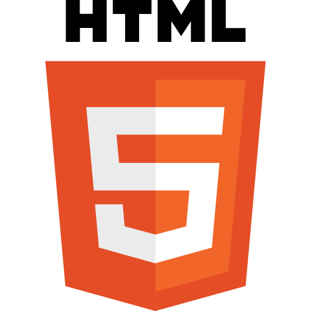
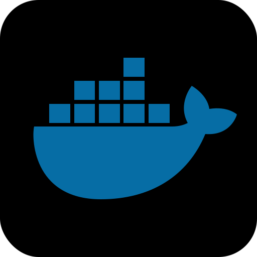
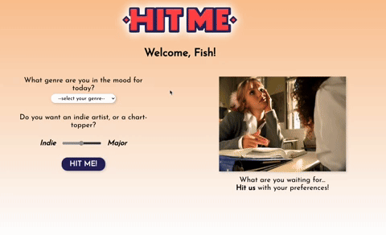
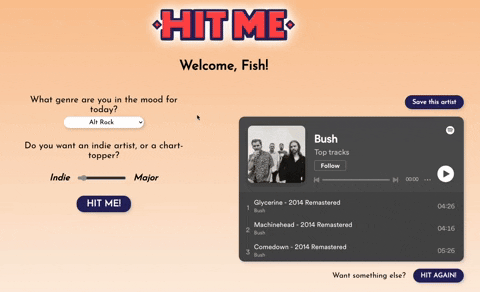
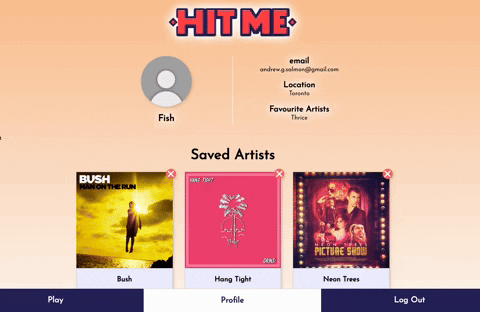
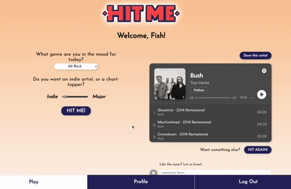

Introducing...

  
  
  
  
  
  
  
  
  
  

Have you ever thought to yourself... "I need some music while I'm working, but I can't decide what to listen to! I need a recommendation..."

Probably often, right?  Me too!  Well, the Hit Me app helps you with just that.  Just open the app, decide on the genre you want, and if you want a hugely popular artist, or one that's way more obscure.  Tell the app what you're looking for, and your soundtrack for the day has been set!

Like the recommendation? Save it, refer back to it later, or even find similar artists!  Or - leave a comment to share what you think of the artist!

<strong>Get artist recommendations</strong>

<strong>Save artists to your profile</strong>

<strong>Comment on artist recommendations you like</strong>

## Start using Hit Me

No need to download and install...  <a href="https://hitme.rocks/register">Start using it now</a> on the live web app!

Interested in the code and building upon it?  Cool!  See instructions below:

## Installing 'Hit Me' locally

To use the app locally, you will need to install this repository (front end), as well as the back end repository.

Install the back end <a href="https://github.com/andrewgsalmon/andrew-salmon-capstone-be" target="_blank">here</a>.

### Front end installation

1. Clone the app to your local machine
2. Install the necessary dependencies (ex. `npm i` via your CLI)
3. Create a .env file in your root directory.  Before we add anything here, we will need to <a href="https://developer.spotify.com/">register for a developer account with Spotify</a>.
4. Create a Spotify account, or login if you already have one.  Once registered and logged in, click "Create App".  Add a name and description of your choosing, set the website URL to localhost:3000, and your redirect URI to localhost:3000/home.
5. Once submitted, go to your new app's settings and make note of your **client ID** and **client secret**.  We'll need these for your .env file.

#### Configure your .env file

To make your app work, you'll need to add the following variables to your .env file:

- *REACT_APP_CLIENT_ID=your_client_ID*

- *REACT_APP_CLIENT_SECRET=your_client_secret*

- *REACT_APP_BASE_URL=http://localhost:8080* --> We'll use this port to connect with the backend in the next step

### Back end installation

1. Clone <a href="https://github.com/andrewgsalmon/andrew-salmon-capstone-be">this back end repo</a> locally.

2. Once cloned, install the necessary dependencies (ex. `npm i` via your CLI).

#### Create a new MySQL database

Create a new schema in a MySQL database, which will allow you to register for an account, leave comments on recommended artists, and save artists to your profile.  Make note of what you called your DB, as you will need this for your .env file!

#### Add and configure your .env file

Here's all the configuration details required for your .env file:

- CLIENT_URL=http://localhost:3000
- CORS_ORIGIN=http://localhost:3000
- PORT=8080
- DB_HOST=127.0.0.1
- DB_DATABASE=your_DB_name
- DB_USER=your_username
- DB_PASSWORD=your_password
- JWT_KEY=your_JWT_key --> Get a
JWT key <a href="https://jwt.io/">here</a>!

##### Additional variables required for future OAUTH implementation:
- CLIENT_ID=your_spotify_clientID
- CLIENT_SECRET=your_spotify_clientID

## Starting your server

Once the above has been completed, complete the following steps in your CLI:

1. `npm run migrate`
2. `npm start`

## Starting the front end

Once the server is up and running, just run `npm start` in your CLI, and you are up and running!

---

I'd love to hear from you!  Reach out below:

  
